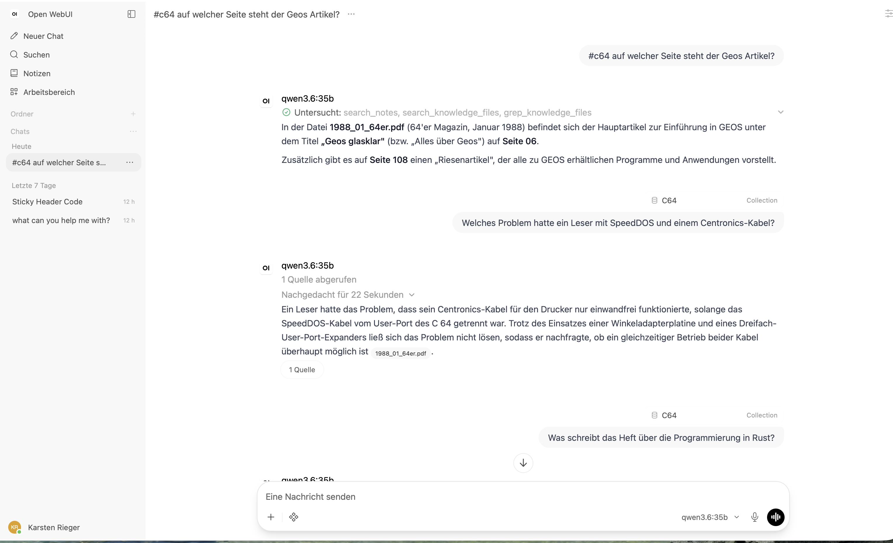
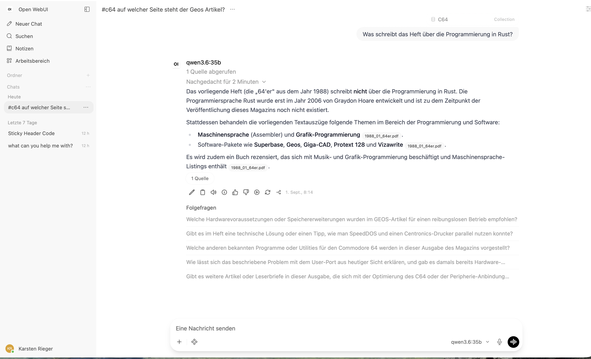

# Home AI Setup

A blueprint for a private AI assistant on your own home network: a chat UI that answers questions about **your** documents, with no data leaving the house.

Everything runs locally — the language model, the document processing, the vector database. No API keys, no cloud, no subscription.

## How this started

I saw a random post of a colleague about setting up a local AI environment. Not just running Ollama, but a slightly more advanced architecture to feed it with random documents to build a RAG and serve it in the local network.

What triggered me was the very vague post itself, and I wondered: how hard would it be to not only build this from the loose requirements described there (treating it as a first draft of an FRD), but to make it available as a tutorial that serves as a blueprint for others?

## What you can do with it

- **Chat with a local LLM** from any device on your network — phone, laptop, tablet.
- **Ask questions about your own documents.** Drop in PDFs, manuals, contracts, scanned magazines; ask in plain language and get answers with source citations.
- **Index a folder automatically.** A nightly job picks up whatever you put in a directory — no manual uploading.
- **Borrow a bigger GPU on demand.** Your always-on host runs the small models; a workstation with more memory can be woken by Wake-on-LAN for the heavy ones.

Here it is answering a question about a scanned 1988 computer magazine, citing the file it took the answer from:



And, just as important, *declining* to answer what isn't in the documents — the test that separates a working RAG from one that just looks impressive:



## What it is made of

| Piece | Role |
|---|---|
| [Ollama](https://ollama.com) | runs the language and embedding models locally |
| [Open WebUI](https://docs.openwebui.com) | the chat interface, user accounts, knowledge collections |
| [Docling](https://github.com/docling-project/docling-serve) | turns PDFs and scans into clean text (OCR included) |
| [ChromaDB](https://docs.trychroma.com) | stores the document vectors |
| NGINX | the single entrance from the LAN, with HTTPS and access control |

Two ways to do the retrieval are covered: let Open WebUI handle it end to end (simple, upload-driven), or run your own nightly indexer over a folder and expose the search as a chat tool (more moving parts, fully automatic).

## Repository layout

```
docker-compose.yml         Linux host (Ollama in a container, NVIDIA GPU)
docker-compose.macos.yml   macOS host (Ollama native for Metal)
.env.example               versions and tuning knobs
nginx/                     HTTP and HTTPS configuration
scripts/                   indexer, backup, Wake-on-LAN, systemd and launchd units
tools/                     the document-search tool for Open WebUI
```

## Getting started

The tutorials are the actual product of this repository — architecture, hardening, backups, troubleshooting, step by step:

- **[English tutorial](TUTORIAL_EN.md)**
- **[German tutorial](TUTORIAL_DE.md)**

You will need a machine that can stay on (a small Linux box with an NVIDIA card, or an Apple Silicon Mac), Docker, and about an evening.

## Status

The macOS path has been run end to end on an Apple Silicon host — model, document extraction with OCR, embedding, retrieval and the hallucination check above. The tutorials record the settings that turned out to matter along the way, including the ones whose defaults quietly break on large documents.
